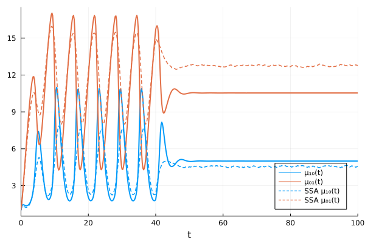

# [Time-dependent Propensity Functions](@id time-dependent-propensities)

Here we consider an example of using time-dependent propensities in modelling chemical reaction networks using MomentClosure and DifferentialEquations. Following [Schnoerr et al. (2015)](https://doi.org/10.1063/1.4934990), we modify the Brusellator introduced earlier to include entrainment:
```math
\begin{align*}
2X + Y &\stackrel{c_1}{\rightarrow} 3X, \\
X &\stackrel{c_2(t)}{\rightarrow} Y, \\
∅ &\underset{c_4}{\stackrel{c_3}{\rightleftharpoons}} X.
\end{align*}
```
The rate constant of the second reaction is now a sinusoidal function of time:
```math
\begin{align*}
    c_2(t) &= c_2^0\left(1+\frac{1}{2}\sin(\omega t) \right), \quad \text{if} \; t \leq \tau, \\
    c_2(t) &= c_2^0, \quad \; \text{if} \; t > \tau,
\end{align*}
```
where $c_2^0$ is a fixed value and the sinusoidal modulation with frequency $\omega$ is switched off after a certain time $\tau$. We can define the model and generate the corresponding moment equations as follows:
```julia
using Catalyst, MomentClosure, Latexify

rn = @reaction_network begin
  (c₁/Ω^2), 2X + Y → 3X
  (c₂*(1+0.5*sin(ω*(t<τ)*t))), X → Y
  (c₃*Ω, c₄), 0 ↔ X
end c₁ c₂ c₃ c₄ Ω ω τ

raw_eqs = generate_raw_moment_eqs(rn, 2, combinatoric_ratelaw=false)
latexify(raw_eqs)
```
```math
\begin{align*}
\frac{d\mu{_{10}}}{dt} =& c{_3} \Omega + c{_1} \mu{_{21}} \Omega^{-2} - c{_2} \mu{_{10}} - c{_4} \mu{_{10}} - c{_1} \mu{_{11}} \Omega^{-2} - 0.5 c{_2} \mu{_{10}} \sin\left( t \omega \left( t < \tau \right) \right) \\
\frac{d\mu{_{01}}}{dt} =& c{_2} \mu{_{10}} + c{_1} \mu{_{11}} \Omega^{-2} + 0.5 c{_2} \mu{_{10}} \sin\left( t \omega \left( t < \tau \right) \right) - c{_1} \mu{_{21}} \Omega^{-2} \\
\frac{d\mu{_{20}}}{dt} =& c{_2} \mu{_{10}} + c{_3} \Omega + c{_4} \mu{_{10}} + 2 c{_1} \mu{_{31}} \Omega^{-2} + 0.5 c{_2} \mu{_{10}} \sin\left( t \omega \left( t < \tau \right) \right) + 2 c{_3} \Omega \mu{_{10}} - 2 c{_2} \mu{_{20}} - 2 c{_4} \mu{_{20}} - c{_1} \mu{_{11}} \Omega^{-2} - c{_1} \mu{_{21}} \Omega^{-2} - c{_2} \mu{_{20}} \sin\left( t \omega \left( t < \tau \right) \right) \\
\frac{d\mu{_{11}}}{dt} =& c{_2} \mu{_{20}} + c{_1} \mu{_{11}} \Omega^{-2} + c{_1} \mu{_{22}} \Omega^{-2} + c{_3} \Omega \mu{_{01}} + 0.5 c{_2} \mu{_{20}} \sin\left( t \omega \left( t < \tau \right) \right) - c{_2} \mu{_{10}} - c{_2} \mu{_{11}} - c{_4} \mu{_{11}} - c{_1} \mu{_{12}} \Omega^{-2} - c{_1} \mu{_{31}} \Omega^{-2} - 0.5 c{_2} \mu{_{10}} \sin\left( t \omega \left( t < \tau \right) \right) - 0.5 c{_2} \mu{_{11}} \sin\left( t \omega \left( t < \tau \right) \right) \\
\frac{d\mu{_{02}}}{dt} =& c{_2} \mu{_{10}} + c{_1} \mu{_{21}} \Omega^{-2} + c{_2} \mu{_{11}} \sin\left( t \omega \left( t < \tau \right) \right) + 2 c{_2} \mu{_{11}} + 2 c{_1} \mu{_{12}} \Omega^{-2} + 0.5 c{_2} \mu{_{10}} \sin\left( t \omega \left( t < \tau \right) \right) - c{_1} \mu{_{11}} \Omega^{-2} - 2 c{_1} \mu{_{22}} \Omega^{-2}
\end{align*}
```
We can now easily close the moment equations using normal closure and solve the resulting system of ODEs:
```julia
using OrdinaryDiffEq, Plots

closed_raw_eqs = moment_closure(raw_eqs, "normal")

# parameter values [c₁, c₂, c₃, c₄, Ω, ω, τ]
p = [0.9, 2., 1., 1., 5., 1., 40.]

# initial molecule numbers of species [X, Y]
u₀ = [1., 1.]

# deterministic initial conditions
u₀map = deterministic_IC(u₀, closed_raw_eqs)

# time interval to solve one on
tspan = (0., 100.)

# convert the closed raw moment equations into a DifferentialEquations ODEProblem
oprob = ODEProblem(closed_raw_eqs, u₀map, tspan, p)

# solve using Tsit5 solver
sol = solve(oprob, Tsit5(), saveat=0.2)
plot(sol, vars=(0, [1,2]), lw=2)
```


It would be great to compare our results to the true dynamics. Using DifferentialEquations, we can run a modified SSA taking into account the time-dependent propensity functions ([VariableRateJumps](https://diffeq.sciml.ai/stable/tutorials/discrete_stochastic_example/#Adding-a-VariableRateJump)). This requires some care and is done by combining an `ODEProblem` with a `JumpProblem`:
```julia
using DiffEqJump

# convert ReactionSystem into JumpSystem
jsys = convert(JumpSystem, rn, combinatoric_ratelaws=false)

# Define an ODEProblem to integrate between reaction events
# note that u₀ elements must be Floats (otherwise throws an error)
f(du,u,p,t) = du .= 0
oprob = ODEProblem(f, u₀, tspan, p)

# Create a modified SSA problem that now correctly incorporates VariableRateJumps
jprob = JumpProblem(jsys, oprob, Direct())
```
Finally, we can define a corresponding `EnsembleProblem` to simulate multiple SSA trajectories. However, the `saveat` argument does not work with VariableRateJumps ([a known bug](https://github.com/SciML/DifferentialEquations.jl/issues/733)): without it, the solution is saved at each reaction event, in turn generating large data arrays that can get extremely memory-intensive when many trajectories are considered. Our workaround is to simply [modify the `output_func` in `EnsembleProblem`](https://diffeq.sciml.ai/stable/features/ensemble/#Building-a-Problem) so that each SSA trajectory is saved to the output array only at the specified timepoints (albeit a lot of garbage collection must be done):
```julia
# timestep at which the solution data is saved
dt = 0.2
# the corresponding time iterator (0:0.2:100 in our case)
ts = tspan[1]:dt:tspan[2]
# save data for each trajectory only at the specified timepoints (interpolating the ODESolution)
fout = (sol, i) -> (sol(ts), false)
ensembleprob  = EnsembleProblem(jprob, output_func=fout)

# simulate 10000 SSA trajectories (can get very slow...)
@time sol_SSA = solve(ensembleprob, Tsit5(), trajectories=10000)
```
```julia
2975.249760 seconds (1.07 G allocations: 105.883 GiB, 81.30% gc time, 0.02% compilation time)
```
Finally, we can compute the mean SSA trajectories and compare to the moment closure estimates:
```julia
using SciMLBase.EnsembleAnalysis

means_SSA = timeseries_steps_mean(sol_SSA)
plot!(means_SSA.t, [means_SSA[1,:], means_SSA[2,:]], lw=1.5, labels=["SSA μ₁₀(t)" "SSA μ₀₁(t)"], linestyle=:dash,
      linecolor=[1 2], background_color_legend=nothing, legend=:bottomright)
```

